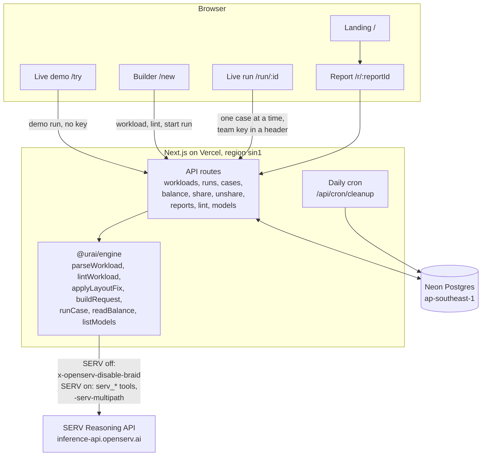
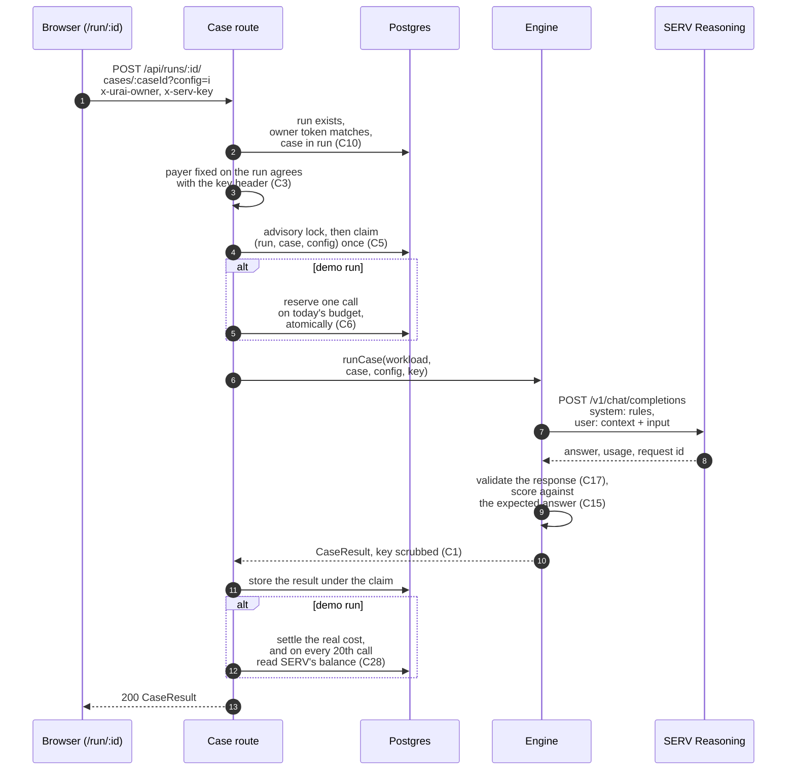
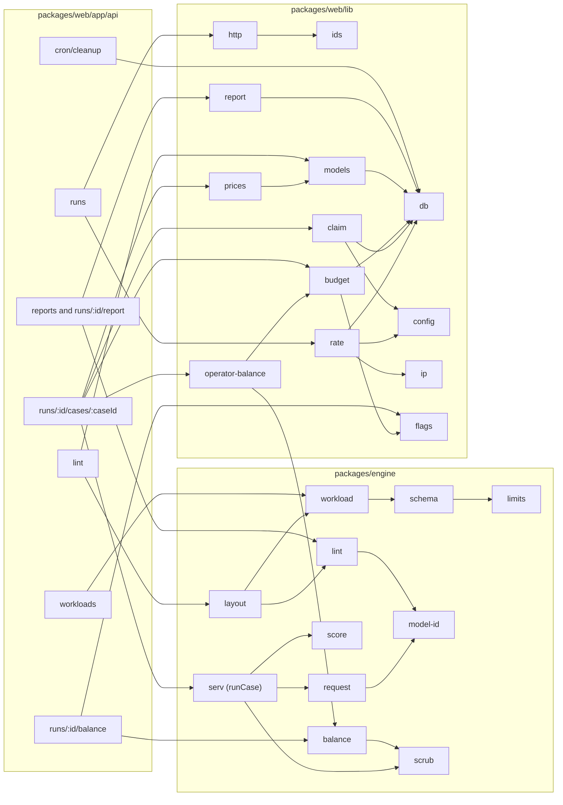

<p>
  
</p>

# Urai

Urai is Tamil for testing gold on a touchstone. It tests SERV Reasoning on your own AI agent.

[Live app](https://urai-serv.vercel.app) · [Docs](https://urai-serv.vercel.app/docs) · [Sample report](https://urai-serv.vercel.app/r/lQF1cJ-lebtC4wNIyXItpw)

## What it does

OpenServ's SERV Reasoning sits between your agent and the model. It rewrites your system prompt into its own reasoning graph and answers through it. On one of our sample agents it came within 5 points of the model alone on 31% fewer tokens. On another it lost 50 points. The only way to know where your agent lands is to run your own cases both ways.

Urai takes your agent's system prompt, its answer schema and a set of test cases where you already know the right answer. It sends every case through the same model with SERV off and with SERV on, scores every answer against the one you wrote down, and puts the two side by side. Before a single call it also checks your setup for the mistakes we measured SERV making worse, and fixes the worst one in one click.

| | Testing SERV today | With Urai |
|---|---|---|
| Whose data | A vendor benchmark on someone else's tasks | Your own cases, with your own expected answers |
| How you compare | Guess from the benchmark, or wire SERV into production and watch | SERV off and SERV on, same model, side by side |
| When you find out | After your users do | Before you switch |
| Setup mistakes | Invisible until accuracy drops | Flagged before you spend anything, with a one-click fix |
| What it costs you | Engineering time to wire it in | One SERV call per case and setting, on your own key |

## Features

### Check your setup and fix it in one click

- The setup check reads your system prompt, answer schema and settings and reports nine kinds of finding, most serious first. It is free, stores nothing and calls no model.
- The worst one is data sitting inside the system prompt. SERV compresses the system prompt into its own graph and drops data it finds there. The check names each block by its heading, kind and size, such as `SUPPLIER BOOK (json, 7342 characters)`.
- "Fix layout" moves every data block into shared data, which travels in the user message. The card shows what will move and the prompt size before and after. "Undo the fix" puts it back. Nothing is applied to a stored workload without you pressing it.

### Run your cases both ways, on your own key

- Pick a model from SERV's live model list, with its price per million tokens, and tick the settings to compare: SERV off, plain, PromptGuard, Multipath or full.
- The builder shows the call count and a cost estimate before you start.
- Every case goes to SERV once per setting, a few at a time, and you watch each answer land in the grid, marked right or wrong.
- Your key lives in the page's memory, rides in a header on each call, and is dropped. It is never stored or logged.

### Read and share a scored report

- Accuracy per setting, the cases where the settings disagreed, input and output tokens, latency, and the real drop in your SERV balance, read from SERV before and after.
- Open any disagreement and read both answers next to the expected one.
- A report is private until you share it. A shared link can be taken back, and it never reveals the run behind it.

### Watch a live run with no key

- The demo on `/try` runs one of three sample agents on our own SERV key, 12 cases with SERV off and on, under a daily budget checked against our real balance.
- Each sample also links to its saved full 40-case report.

## Live proof

Four sample runs, all on `gpt-6-luna`, 40 invoices each, as normal team runs. SERV on means SERV Reasoning in plain mode. The balance drop is the real change in the key's balance, read from SERV before and after.

| Report | What it compares | SERV off | SERV on | Balance drop | Open it |
|---|---|---|---|---|---|
| Before the fix | Supplier book inside the system prompt, SERV plain | not run | 27 of 40, 67.5% | $0.03 | [/r/Hb-KceFRYlnwlohJbOD4OQ](https://urai-serv.vercel.app/r/Hb-KceFRYlnwlohJbOD4OQ) |
| After the one-click fix | Supplier book moved to the user message, SERV plain | not run | 39 of 40, 97.5% | $0.03 | [/r/lQF1cJ-lebtC4wNIyXItpw](https://urai-serv.vercel.app/r/lQF1cJ-lebtC4wNIyXItpw) |
| Good layout | SERV off against SERV plain | 40 of 40, 100% | 38 of 40, 95% | $0.05 | [/r/EcaTkn78IZ3bLHi0BJcXAg](https://urai-serv.vercel.app/r/EcaTkn78IZ3bLHi0BJcXAg) |
| Hard set | 152 clauses in four sources, SERV off against SERV plain | 39 of 40, 97.5% | 19 of 40, 47.5% | $0.10 | [/r/VowHwvFGztQ-aGvCF_9PZw](https://urai-serv.vercel.app/r/VowHwvFGztQ-aGvCF_9PZw) |

The first two are the same agent, the same 40 invoices and the same model. The only change is where the supplier data sits, and that was worth 30 points. On the good layout SERV came within 5 points of the model alone on 31% fewer tokens. On the hard set it lost 50 points. The losing run is here on purpose: a tester that only ever says yes is not a tester.

## How it fits together

The browser drives a run, the server makes exactly one SERV call per case and setting, and the engine is a plain library the server calls.



One case, end to end: every check that guards money happens before the SERV call, and the result is stored under a claim so a repeat call never spends twice.



The module map: the engine has no framework and no database, so every SERV call, score and lint rule is tested on its own, and the web package adds storage, money rules and pages.



The full map, with the data model, is in [ARCHITECTURE.md](ARCHITECTURE.md).

## The two-minute judge path

1. Open the [landing page](https://urai-serv.vercel.app). The first screen asks "Is SERV gold for your agent?" and shows the one layout fix that took SERV from 67.5% to 97.5%. Scroll to the setup check to watch that fix play out.
2. Open [/try](https://urai-serv.vercel.app/try), pick a sample agent and press "Run it live". Twelve cases go out with SERV off and on, three calls at a time, and each answer lands in the grid as it comes back. No key needed.
3. Open the [before the fix](https://urai-serv.vercel.app/r/Hb-KceFRYlnwlohJbOD4OQ) report, then the [after the fix](https://urai-serv.vercel.app/r/lQF1cJ-lebtC4wNIyXItpw) report. Same agent, same invoices, 27 of 40 against 39 of 40.
4. Open [/new](https://urai-serv.vercel.app/new) and press "Data in the wrong place" under "Start from a sample". The setup check flags "Data sits inside the system prompt". Press "Fix layout" and watch the supplier book move out of the prompt.
5. Open [/docs/proof](https://urai-serv.vercel.app/docs/proof) for every sample report, the latest security record and the prove command.

The prove command runs Urai end to end over HTTP against a running server. It spends about 0.05 USD of real SERV credit and stops before 0.10 USD.

```bash
cd packages/web
npm run prove -- --base https://urai-serv.vercel.app
```

Our run on 24 Sep 2026, against a local production build of this repo, printed:

```text
Urai prove-it against http://localhost:3102
[PASS] 1 GET /api/models
       34 models, verified true, fetched 2026-09-24T05:32:50.586Z
       gpt-6-luna: 0.13 in / 0.65 out USD per million tokens
[PASS] 2 POST /api/lint on invoices-bad
       findings: data-in-system-prompt (error), quotes-instructions (warning), first-sight-cost (info), large-system-prompt (info)
       fix: yes, moved SUPPLIER BOOK (7342 chars) out of the system prompt
[PASS] 3 team run: the fixed workload's first 10 cases, raw and plain
       accuracy: gpt-6-luna raw 10/10 = 100.0%, gpt-6-luna plain 10/10 = 100.0%
       operator balance: 3.3100 -> 3.3000 USD (SERV reports whole cents), token estimate 0.0204 USD
[PASS] 4 demo run: sample-invoices-good, 12 cases x 2 configs, no key
       accuracy: gpt-6-luna raw 12/12 = 100.0%, gpt-6-luna plain 12/12 = 100.0%
       demo budget effect: about 0.0243 USD, from the report's per-config cost
[PASS] 5 share the demo run, then GET /api/reports/:reportId with no header
       reportId GMpGlG0MXi29VaYSCAF7eA: same totals as the owner's report (gpt-6-luna raw 12/12 = 100.0%, gpt-6-luna plain 12/12 = 100.0%), and the run id is nowhere in it
spend: about 0.0447 USD from token counts, cap 0.1
RESULT: PASS (5 of 5 steps)
```

Any failed step prints `[FAIL]` with the reason and the command exits with code 1.

## Quick start

You need Node.js and npm, a free Neon Postgres project, and a SERV key from console.openserv.ai.

```bash
git clone https://github.com/ramakrishnanhulk20/Urai.git
cd Urai
npm install
cp .env.example .env
```

Fill in `.env` at the repository root. Every variable is explained in `.env.example`. Then:

```bash
cd packages/web
npm run migrate
npm run seed
npm run dev -- --port 3101
```

Open `http://localhost:3101`. `migrate` creates the tables and is safe to run twice. `seed` adds the three sample workloads. Port 3101 is the one `npm run prove` expects by default. The full guide, including how to run the security suite, is at [/docs/developers/self-host](https://urai-serv.vercel.app/docs/developers/self-host).

## API

The pages use the same routes you can call yourself. Every route takes and returns JSON. Every refusal answers with an error code and nothing else, and a wrong owner token looks exactly like an unknown run.

| Call | Who | Sends | Gets |
|---|---|---|---|
| POST /api/workloads | anyone | { workload } | { workloadId, ownerToken } |
| POST /api/lint | anyone | { workload, configs? } | { findings, fix } or 400 with reasons |
| GET /api/models | anyone | nothing | { models, fetchedAt, verified } |
| POST /api/runs | anyone | { workloadId, configs, payer } plus the workload owner token for team runs | { runId, reportId, ownerToken, cases, configs } |
| POST /api/runs/:id/cases/:caseId?config=i | run owner | x-urai-owner, and x-serv-key on team runs | the scored CaseResult, or 202 while it runs |
| POST /api/runs/:id/balance | run owner, team runs | x-urai-owner, x-serv-key | { usd } or { unavailable } |
| GET /api/runs/:id/report | run owner | x-urai-owner | the full report |
| POST /api/runs/:id/share and /unshare | run owner | x-urai-owner | { reportId } or { shared: false } |
| GET /api/reports/:reportId | anyone with the link | nothing | the report, only while shared |

Every route, header and error code is at [/docs/developers/api](https://urai-serv.vercel.app/docs/developers/api).

## Test results

From the proof run on 24 Sep 2026.

```text
packages/engine   npm test                  236 passed
packages/web      npm test                  116 passed, 1 skipped
live security     npm run verify-security   70 OK, 0 BROKEN, 0 PENDING
```

The security suite attacks a running server to test every rule in the threat model. Its record for that run is [docs/security/checks/run-2026-09-24T05-52-56.500Z.md](docs/security/checks/run-2026-09-24T05-52-56.500Z.md).

## What a run costs

Each case under each setting is one SERV call, billed to your own key at SERV's prices. Forty cases under two settings is eighty calls. The builder shows the count and an estimate before you start, and the report shows the real drop in your SERV balance afterwards.

For scale, our four 40-case sample runs on `gpt-6-luna` took $0.03, $0.03, $0.05 and $0.10 off the key's balance. Two SERV charges come on top of tokens: building the reasoning graph the first time SERV sees a system prompt, about 0.60 USD in our runs, and the full setting at about 0.25 USD per call.

The live demo runs on our key, on our sample agents only, inside a daily budget. When the day's budget is spent, the demo pauses until the next day and points you to the saved reports.

## Project structure

| Folder | What it is |
|---|---|
| `packages/engine` | The TypeScript library that talks to SERV: parses a workload, builds each request, runs one case, scores the answer, reads the balance, runs the setup check and the layout fix. No framework, no database. |
| `packages/web` | The Next.js app: the landing page, `/try`, `/new`, the live run, reports, `/docs`, the API routes and Postgres storage, plus the migrate, seed, prove and security scripts. |
| `packages/bench` | The research benchmark that came first: 40 synthetic supplier invoices against a 43-clause payables rulebook, and a 152-clause hard set, sent to SERV in each mode and scored against labels. |
| `packages/haggle` | A second research benchmark: scripted multi-turn sales conversations against a written pricing policy, scored by arithmetic on whether the agent gave away money the policy does not allow. |
| `docs/security` | The system description, the threat model with invariants C1 to C34, and the record of every security suite run. |

## Tech stack

| Layer | What we use |
|---|---|
| SERV | SERV Reasoning API at inference-api.openserv.ai: plain, PromptGuard, Multipath, full, the raw switch and the live model list |
| App | Next.js 16.3.6 (App Router), React 19.3.0, TypeScript 7.0.2 |
| Styling and motion | Tailwind CSS 4.3.3, Motion 13.4.2, GSAP 3.15.0 with ScrollTrigger, Lenis 1.3.26, Archivo and Geist Mono through next/font |
| Validation | Zod 4.6.5, Ajv 8.20.0 for the team's own answer schema |
| Storage | Neon Postgres through @neondatabase/serverless 1.1.0 |
| Docs | Fumadocs 16.15.13 inside the same app at `/docs`, Mermaid 12.0.0 for the diagrams |
| Tests | Vitest 5.0.1, plus the prove command and the live security suite |
| Hosting | Vercel, region sin1, with a daily clean-up cron |

## Security

Urai handles a SERV key that can spend a team's credit, a test set that is often private evaluation data, and our own money on the public demo. We wrote the rules that protect all three as a threat model before writing any code, then built a suite that attacks a running server to check them. It now holds 34 invariants; the last two came from the final code review.

- Your key is never stored. It is forwarded to SERV for one call and never reaches the database, a log line, an error, a response or a report (C1). The only address a key is ever sent to is SERV's, fixed in code (C2).
- Who pays is fixed when a run is created and cannot change halfway (C3). A demo run can only use our sample workloads with the settings we allow, so your text never travels on our key (C4).
- Each case under each setting is spent at most once, even with ten identical calls at the same moment (C5).
- The demo budget is reserved atomically before each call (C6) and checked against the operator key's real balance on the first demo call of each day and every 20 calls after (C28).
- Reports are private until the run's owner shares them (C11) and can be taken back (C30). A report link reveals no run id and cannot drive the run (C9). Every id is random and at least 128 bits (C8).
- The one-click fix is shown to you, never applied to a stored workload on its own (C21). Cross-origin requests are refused (C22).
- Urai is never an open relay for bad keys: calls SERV refuses count against a small hourly budget per network, and past it nothing more is sent (C33).
- Every production page tells the browser to connect only to Urai, so the key held in page memory cannot be posted anywhere else (C34).

The full list is in [docs/security/threat-model.md](docs/security/threat-model.md), and the latest attack record is [docs/security/checks/run-2026-09-24T05-52-56.500Z.md](docs/security/checks/run-2026-09-24T05-52-56.500Z.md).

## Where it goes next

- Free stays free: the setup check, the live demo and the sample reports, so any team can see what SERV does to an agent like theirs.
- Paid for teams: saved workspaces, scheduled re-runs, and an alert when SERV's model list changes and your results move. SERV's changelog for 11 Sep 2026 removed 13 models from the catalog in one go. A team running on one of them needs to know before its agent breaks, and what its numbers look like on the replacement.
- A route for OpenServ: its own day-one guide tells teams to benchmark SERV against the path they already run, on production-like inputs, before they switch. Urai is that benchmark as an open tool OpenServ can point every prospect to.

## Licence

MIT. See [LICENSE](LICENSE).

## Acknowledgments

Built on [OpenServ](https://www.openserv.ai)'s SERV Reasoning, for the SERV Hackathon, Edition 01. Thanks to the OpenServ team for the public API, the docs and the live model list that Urai reads on every run.
