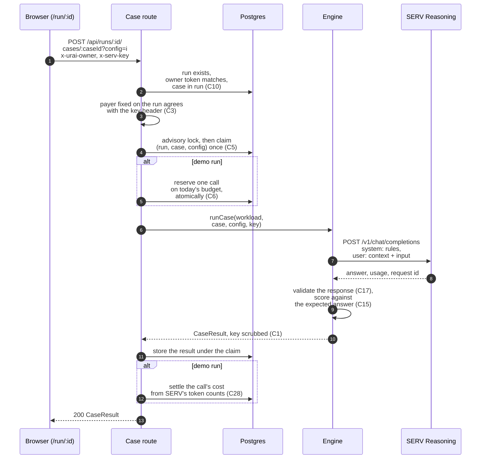

A run is every case in your workload under every setting you picked. Two settings and 40 cases is 80 calls. Your browser drives the run. The server runs one case under one setting per request, makes exactly one SERV call for it, scores the answer and stores it.

## One case, end to end

In words:

1. When you press "Start the run" on [/new](/new), Urai saves your workload, creates the run, and hands your browser a one-time owner token for it. The run fixes who pays at that moment: your key for your own workloads, our key only for the demo samples. It cannot change later (C3).
2. The run page asks the server to run one case under one setting. The request carries the owner token in `x-urai-owner` and your key in `x-serv-key`.
3. The server checks the run, the token and the case before anything else. A wrong token looks exactly like a run that does not exist (C10).
4. It claims that case and setting in the database. The claim is the guard against paying twice.
5. The engine builds the request, sends it to SERV, and waits up to 120 seconds for the answer. A demo call also carries a cap of 8,192 output tokens, so one runaway answer cannot cost more than the budget reserved for it.
6. It checks every field SERV sent back, then scores the answer against your expected answer.
7. The server stores the result, forgets your key, and returns the scored result to your browser, which paints it into the grid.

## Each call is spent once

Every (run, case, setting) is claimed once. Ask again for a case that already finished and you get the stored result back, with no second SERV call. Ask while the first request is still running and you get 202, and the browser asks again shortly (C5). Clicking twice, reloading, or a flaky network cannot make you pay twice for the same answer.

The exceptions are all calls SERV billed to no one, and they are in your favour. If SERV refuses your key with 401, or turns the call down with 402 because your key is out of credit, Urai releases the claim instead of storing it. Paste a working key, or top up, and that case runs again. A call that never reached SERV, because the connection failed, or that SERV turned away with 429, is released the same way on team and demo runs alike, and a demo call hands its reserved budget back.

## Four calls at a time

The server allows at most four calls in flight per run. The run page sends three at a time, one under the limit, so a slow call releasing its claim never trips it. Rows fill from the top: every setting of a case is sent next to each other.

## The browser drives it

Nothing runs on a schedule in the background. The run moves forward only while its page is open and asking.

- Pause stops new calls. The button reads "Pausing" while the calls already sent finish and are stored. Press "Resume the run" to carry on from where it stopped.
- An outage pauses the run for you. Three calls in a row that never reach SERV or come back with no answer stop new calls, and the page says "SERV is not answering right now." The calls that never reached SERV cost nothing and wait for "Resume the run".
- Reloading the page keeps the run, because the owner token lives in the tab's `sessionStorage`. Your key does not survive a reload, so the page asks for it again, and nothing finished is run twice. A key is held for the one run it was typed for, so another run in the same tab can never spend it.
- Closing the tab stops the run where it is, and nothing new is sent. The owner token dies with the tab, on purpose, unless you pressed "Copy private link" first. That link carries the token after a `#`, which browsers never send to a server, so opening it in any browser brings the run back without the token ever reaching Urai in a URL. It never carries your key, so nothing is spent until you paste the key again. Anyone holding the link can open the run, so before any key field appears the page shows what a key would pay for: the run's name, its settings, how many calls are left and the start of its system prompt. Nothing goes further until you press "This is my run". Answers already stored stay stored, and if you shared the report before closing, its link keeps working.

## Scoring

Each answer goes through the same checks, in this order:

1. No usable response, or a response that fails validation, is recorded as an upstream error or a timeout and is not scored.
2. A refusal from PromptGuard is recorded as refused.
3. An answer SERV's content filter cut is recorded as filtered.
4. An empty answer, one that is not JSON, one that breaks your answer schema, or one over 20,000 characters is recorded as failed.
5. Everything else is scored: each scoring rule compares one field against your expected value, and the answer is correct only when every rule matches.

In the accuracy numbers, anything that is not a correct scored answer counts as wrong. The report names how many of the wrong ones never got scored, so a model that disagreed is never mixed up with a call that failed. The rules themselves are on [Workload format](/docs/getting-started/workload-format), and the statuses are explained on [Read a report](/docs/guides/read-a-report).
