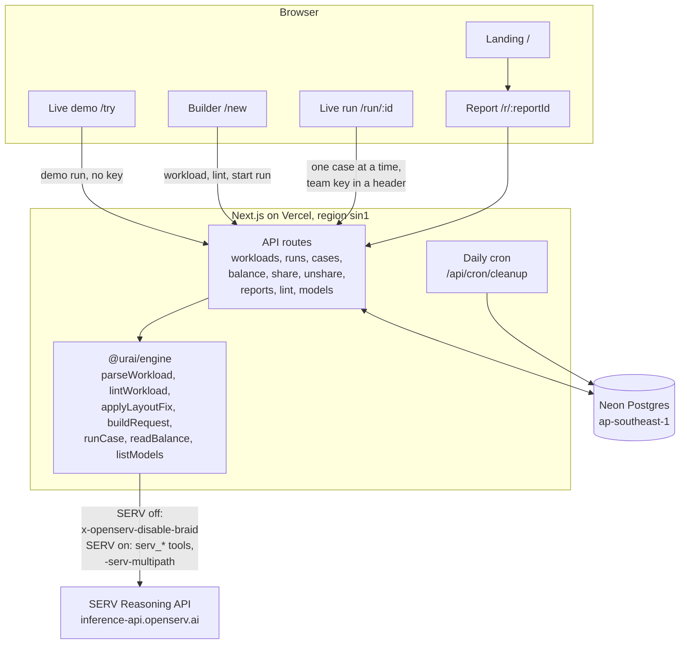
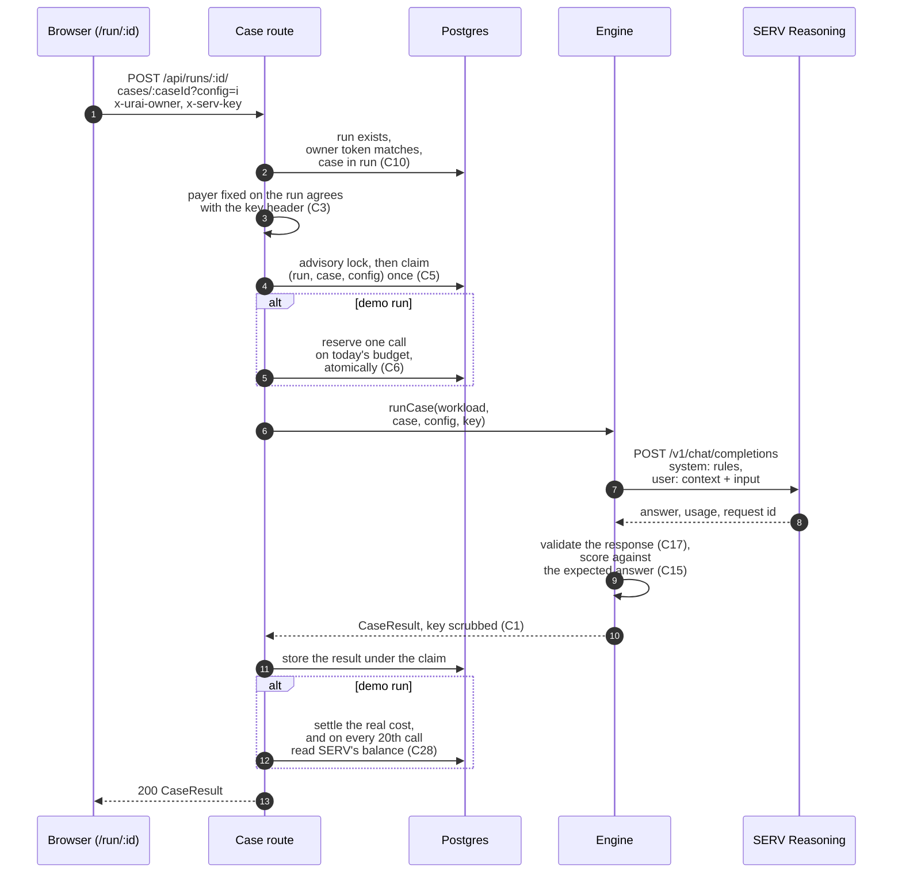
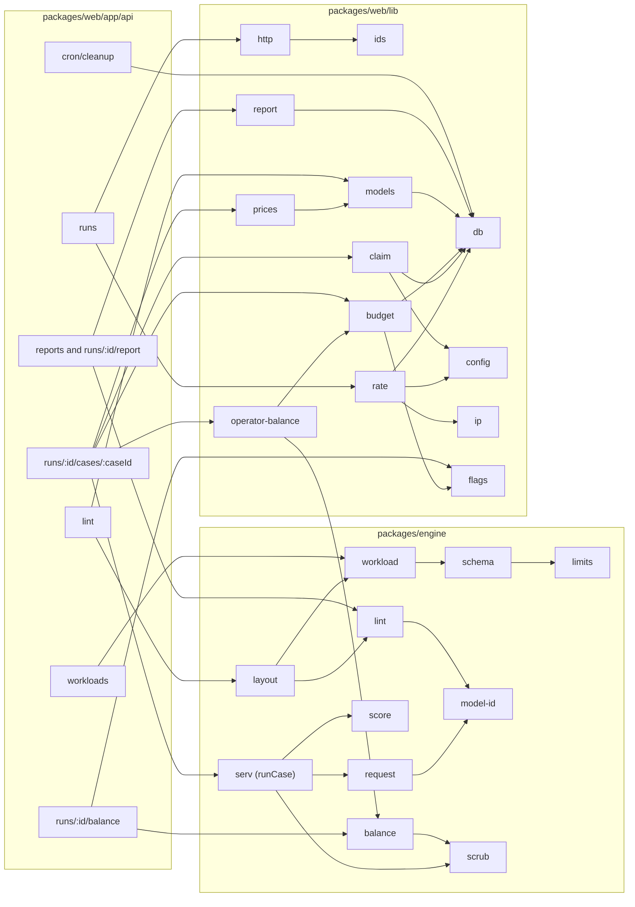

Urai is one Next.js app on Vercel, one Postgres database on Neon, and a plain TypeScript engine package that talks to SERV. This page is the map: three diagrams, the data model, and the rules that hold it together. The routes are on [API](/docs/developers/api).

## System overview

The browser drives a run: it asks the server to run one case under one setting, a few at a time. The server makes exactly one SERV call per case and setting, stores the scored result, and forgets the key. The team's key never reaches the database, a log line or a response (C1). Demo runs use the operator's key on operator samples only, inside a daily budget checked against SERV's real balance (C4, C6, C28).

## One case, end to end

A repeated call for the same case and setting gets the stored result back without a second SERV call. Calls that arrive while the first is running get 202 and ask again. On a team run, a call SERV refuses with 401 is released instead of stored, so the owner can run it again with a working key.

## Module dependencies

The engine is a plain TypeScript library with no framework and no database, so every SERV call, every score and every lint rule can be tested on its own. It has 236 tests. The web package adds storage, money rules and the pages. What the engine exports is on [Engine](/docs/developers/engine).

## Data model

| Table | Holds | Notes |
|---|---|---|
| workloads | the team's rules, context, answer schema, scoring and cases | owner token stored as a hash; expires after 30 days; samples never expire |
| runs | the settings compared, who pays, the case list, share state | run id and report id are independent random secrets (C8, C9) |
| case_results | one scored result per (run, case, setting) | the primary key is the double-spend guard (C5) |
| demo_budget | per UTC day: cap, reserved, spent, calls, start balance, stopped | one conditional update per reservation (C6, C28) |
| rate_limits | per address, per hour, per kind | IPv6 grouped by /64 |
| model_cache | SERV's live model list and prices | refreshed at most hourly, 60 s back-off on failure |
| app_flags | global stops, for example probe_ran | cleared only by the operator |

Every public id is 16 random bytes, 128 bits, drawn server-side (C8). Owner tokens are 32 random bytes, shown once, and stored only as a hash.

## The rules that hold it together

Every refusal answers with an error code and no detail from the input. The one exception is the setup check, which lists the reasons it could not read a workload back to the sender only. A wrong owner token looks exactly like an unknown run: both are 404. The full rules are the threat model's invariants C1 to C34, summarised on [Threat model](/docs/security/threat-model). The security suite tests C1, C3 to C14, C20 to C22, C26 and C29 to C31 against a running server and confirms the unit tests for C15 to C19; the rest are held by the code and its unit tests. The latest record is on [Security checks](/docs/security/checks).
